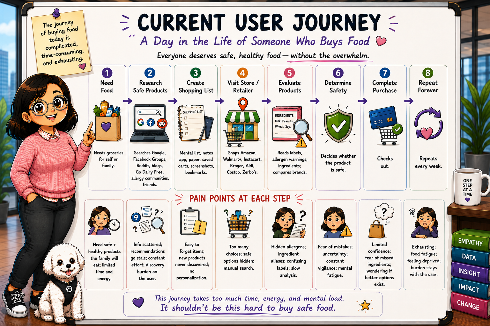

# AI Product Discovery & User Journey — Akshaya Patra

**Author:** Ushasree Jakilinki
**Date:** 2026-07-24
**Status:** Discovery WIP

> *Why this exists:* a PRD specifies a solution. This document establishes the problem, the users, and the job to be done — the evidence the solution has to earn.
>
> **Tagline:** Transforming food anxiety into culinary abundance.
> **Mission:** Help people with allergies, dietary restrictions, and health goals discover safe, preferred, and healthy foods — without the burden of continuous research.

## 1. Problem Discovery

**What problem are we solving?**
People with food allergies, dietary restrictions, and health goals carry the **entire burden of discovering** safe, preferred, and healthy food. Safe products exist — but finding them means researching ingredients across scattered sources, decoding allergen aliases, and searching thousands of products on every shopping trip.

**Why does it matter now?**
Grocery platforms already hold the purchase signals that reveal each customer's dietary needs, yet treat every trip as if they know nothing about the shopper. The data to solve this exists and is going unused.

**What evidence shows this is a real problem?**  *(to expand)*

- The current user journey (§3) — the manual, repeated research burden.
- Allergy/dietary communities (Go Dairy Free, allergy forums) that exist because discovery is hard.
- *(add: prevalence stats, published sources, user interviews when available)*

**What is the current baseline?**
A weekly cycle of manual research, label-reading, and limited choices — the discovery burden never leaves the user.

---

## 2. User Discovery

### Personas

| **Primary Users**                                              | **Dietary Needs They Bring**      |
| -------------------------------------------------------------------- | --------------------------------------- |
| Food-allergy sufferers                                               | Top 9 allergens                         |
| Individuals with celiac disease                                      | Gluten                                  |
| People with dietary restrictions                                     | Vegan · Vegetarian · Keto             |
| People managing chronic conditions (diabetes, heart disease, weight) | Low sugar · High protein · Low sodium |
| Parents and caregivers                                               | Multiple needs across one household     |

**Secondary users:** health-conscious shoppers; grocery retailers seeking better personalization.
**Admins / operators / reviewers:** *(to define — who maintains the allergen dictionary, reviews flagged items)*
**Edge-case users:** *(to define — e.g., shopping for a guest, multiple severe allergies, non-English labels)*

### Jobs To Be Done

| When                                                                                | Help me                                                                                                   | So that                                                                            |
| ----------------------------------------------------------------------------------- | --------------------------------------------------------------------------------------------------------- | ---------------------------------------------------------------------------------- |
| When I shop for food with allergies, dietary restrictions, or specific health goals | discover safe, relevant, and appealing products without spending hours researching ingredients and labels | I can shop with confidence, save time, reduce anxiety, and enjoy more food choices |

- **What triggers the need?** Weekly shopping, new diagnosis, new restriction, running low, school lunches, special occasions.
- **What does success look like?** A safe, appealing product in the cart with minimal research.
- **What alternatives do they use today?** Google, allergy communities, blogs, friends, manual label-reading (see §3).

---

## 3. Current User Journey (Before solution)

<p align="center">
  
</p>

|                    | Step 1: Need Food                                                                                                | Step 2: Research Safe Products                                                                | Step 3: Create Shopping List                                             | Step 4: Visit Store / Retailer                                    | Step 5: Evaluate Products                                              | Step 6: Determine Safety                                           | Step 7: Complete Purchase                                                          | Step 8: Repeat Forever                                                  |
| ------------------ | ---------------------------------------------------------------------------------------------------------------- | --------------------------------------------------------------------------------------------- | ------------------------------------------------------------------------ | ----------------------------------------------------------------- | ---------------------------------------------------------------------- | ------------------------------------------------------------------ | ---------------------------------------------------------------------------------- | ----------------------------------------------------------------------- |
| **Behavior** | Needs groceries for self or family.                                                                              | Searches Google, Facebook Groups, Reddit, blogs, Go Dairy Free, allergy communities, friends. | Mental list, notes app, paper, saved carts, screenshots, bookmarks.      | Shops Amazon, Walmart+, Instacart, Kroger, Aldi, Costco, Zerbo's. | Reads labels, allergen warnings, ingredients; compares brands.         | Decides whether the product is safe.                               | Checks out.                                                                        | Repeats every week.                                                     |
| **Triggers** | Weekly shopping; running out of food; school lunches; special occasions; new diagnosis; new dietary restriction. | Need to verify ingredients and safety.                                                        | Need to remember safe items and product ideas.                           | Need to find products among thousands of options.                 | Need to confirm hidden ingredients and allergen aliases.               | Need to avoid mistakes and unsafe products.                        | Need to complete the purchase with confidence.                                     | Grocery needs continue every week.                                      |
| **Pain**     | Need safe + healthy products the family will eat; limited time and energy.                                       | Info scattered; recommendations go stale; constant effort; discovery burden on the user.      | Easy to forget items; new products never discovered; no personalization. | Too many choices; safe options hidden; manual search.             | Hidden allergens; ingredient aliases; confusing labels; slow analysis. | Fear of mistakes; uncertainty; constant vigilance; mental fatigue. | Limited confidence; fear of missed ingredients; wondering if better options exist. | Exhausting; food fatigue; feeling deprived; burden stays with the user. |

> 💡 **Step 2:** *"There are safe products out there, but discovering them is entirely up to me."*
> 💡 **Step 8:** *The problem is not buying food. The problem is discovering safe, preferred, and healthy food within an overwhelming number of choices.*

**Where the burden sits today:**

```
User discovers → User researches → User validates → Retailer sells
```

**The burden remains entirely with the user.**

---

## 4. Pain Points & User Needs

| **Ingredients & Safety**                | **Discovery & Choice**                    | **Effort & Access**                         | **Emotional Toll**       |
| --------------------------------------------- | ----------------------------------------------- | ------------------------------------------------- | ------------------------------ |
| Hidden allergens in products                  | Safe options buried among thousands of products | Information scattered across platforms            | Constant vigilance             |
| Ingredient aliases (one allergen, many names) | New/better products never surface               | Recommendations go stale; require constant effort | Fear of mistakes               |
| Confusing, time-consuming labels              | No personalization or proactive suggestions     | Repeated manually, every single week              | Food fatigue; feeling deprived |

> ### ⇩ And the result of all of it:
>
> ## **The discovery burden never leaves the user.**

*(to add: frequency & severity per pain, business impact)*

---

## 5. Opportunity Assessment

**The core opportunity (Key Product Insight):**
Consumers repeatedly reveal their dietary preferences through purchasing behavior. But grocery retailers treat every trip as if they know nothing about the customer. Purchase history already contains signals for **dairy-free · gluten-free · soy-free · vegan · vegetarian · low sugar · high protein · allergy-friendly** — yet these signals are rarely used. **Akshaya Patra connects those dots.**

*(to complete together)*

- Which pain points are worth solving first?
- Which opportunities are largest?
- Which are feasible?
- Which are strategic?

---

## 6. Why AI?

*(to complete together)*

- Why is AI needed instead of rules or plain automation?
- What can AI do better here?
- What can AI **not** do well?
- Where is human judgment still required?

---

## 7. Future AI User Journey

|                       | Step 1: Profile Created                                                         | Step 2: Patterns Identified                                                                | Step 3: AI Discovers Products                                                       | Step 4: Personalized Recs                                                          | Step 5: One-Click Add                                   | Step 6: Continuous Discovery                                           |
| --------------------- | ------------------------------------------------------------------------------- | ------------------------------------------------------------------------------------------ | ----------------------------------------------------------------------------------- | ---------------------------------------------------------------------------------- | ------------------------------------------------------- | ---------------------------------------------------------------------- |
| **Behavior**    | User sets preferences, or the system infers them from behavior.                 | Analyzes purchase history, repeats, avoided products, dietary patterns, brand preferences. | Finds new products, brands, seasonal items, alternatives, healthier options, sales. | Surfaces tailored recs (new dairy-free items, sale alerts, similar-shopper picks). | User adds a recommendation to cart with minimal effort. | Monitors inventory, launches, dietary matches, discounts continuously. |
| **Triggers**    | New account setup, new diagnosis, or inferred preferences from prior purchases. | Enough shopping data is available to identify patterns.                                    | New products launch, inventory changes, or matching products appear.                | A relevant product, discount, or alternative is available.                         | User is ready to buy a safe or preferred item.          | Ongoing changes in inventory, pricing, and promotions.                 |
| **Pain Solved** | Removes the from-scratch burden.                                                | Replaces manual research with pattern recognition.                                         | No more hunting through thousands of products.                                      | Relevant options instead of generic search.                                        | Cuts research time; simplifies the decision.            | Discovery becomes proactive, not user-driven.                          |

### Worked example — same engine, two different shoppers

|                                            | Dietary profile (from behavior)                          | What Akshaya Patra recommends                                    | Outcome                                                          |
| ------------------------------------------ | -------------------------------------------------------- | ---------------------------------------------------------------- | ---------------------------------------------------------------- |
| **Customer 1** (Dairy-free)          | Buys almond milk, oat milk, dairy-free yogurt            | **Oreo · Lotus Biscoff** — dairy-free by ingredient list | ✅ Safe, familiar cookies the shopper never knew were dairy-free |
| **Customer 2** (Gluten-free & Vegan) | Buys gluten-free bread, vegan cheese, plant-based snacks | **Sweet Loren's Gluten-Free & Vegan Chocolate Chunk**      | ✅ A treat built for exactly this dual restriction               |

*Same recommendation engine, two profiles, two very different — but equally safe and delightful — results.*

> ⚠️ **Safety carries through from the PRD:** where the system *infers* a preference from behavior, it is a **suggestion the user confirms** — it never silently gates safety. Safety exclusions always run off the *confirmed* profile.

**The shift:**

| Current State    |    | Future State            |
| ---------------- | -- | ----------------------- |
| Food anxiety     | → | Personalized discovery  |
| Manual discovery | → | Trusted recommendations |
| Research burden  | → | Safe choices            |
| Limited options  | → | Culinary abundance      |

**Current:** food-safety discovery is *manual*. → **Future:** food-safety discovery is *intelligent*.

---

## 8. AI Experience Design

*(to complete together)*

- Input methods · Output format · Explainability · Confidence display · Error handling · Fallback behavior · User control and override

---

## 9. Data Discovery

*(to complete together)*

- Required data sources · Data quality · Completeness · Label availability · Data ownership · Privacy & access constraints · Integration points

---

## 10. AI Requirements

*(to complete together)*

- Functional requirements · Non-functional requirements · Latency targets · Accuracy targets · Explainability requirements · Security requirements · Compliance requirements

---

## 11. Human-in-the-Loop

*(to complete together)*

- Where humans review outputs · What thresholds trigger review · What humans can override · Escalation paths · Audit and accountability

---

## 12. Evaluation Plan

*(to complete together)*

- Offline evaluation · Human review evaluation · User acceptance criteria · Business KPI impact · Error analysis · Monitoring plan

---

## 13. MVP Scope

*(to complete together)*

- In-scope features · Out-of-scope features · MVP assumptions · MVP success criteria · Release criteria

---

## 14. Cost & Feasibility

*(to complete together)*

- Build cost · Data cost · Inference cost · Operational cost · Technical complexity · Team & timeline feasibility

---

## 15. Risks & Roadmap

*(to complete together)*

- Technical risks · Product risks · Data risks · Compliance risks · Adoption risks · Mitigation plan · Phased roadmap

---

## 16. Responsible AI Check

*(to complete together)*

- Intended use · Out-of-scope use · Prohibited use · Stakeholders & impact · Fairness & bias · Reliability & safety · Privacy & data governance · Security & resilience · Transparency & explainability · Human oversight · Accountability & governance · Vendor & third-party risk · Monitoring after launch · Social & ethical impact

---

## User Stories *(supporting §2)*

**Primary — the shopper**

> As a shopper with food allergies, dietary restrictions, or specific health goals, I want personalized recommendations for safe products based on my shopping history, so that I can spend less time researching and more time enjoying food.

**Secondary — the caregiver**

> As a parent or caregiver shopping for a household with different dietary needs, I want recommendations that respect every member's restrictions at once, so that I can shop safely for the whole family without researching each product separately.

---

*Promise: **We find what you can't see.***
