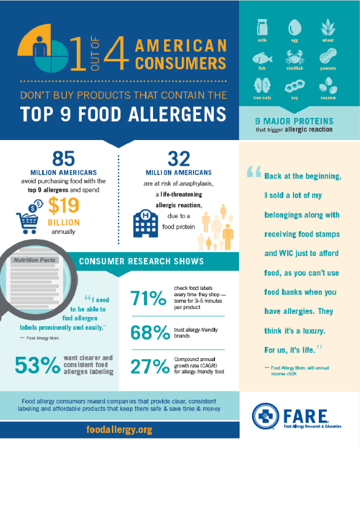
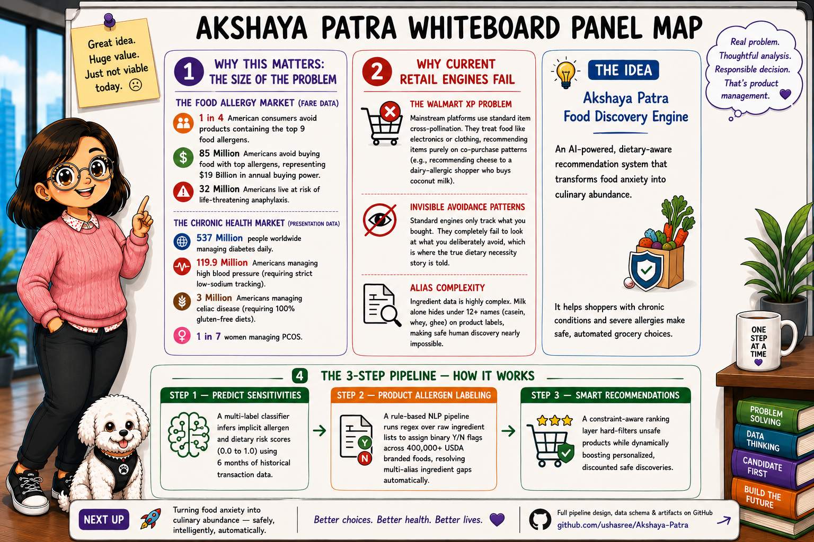

# Akshaya Patra — Executive Summary

> *Netflix understands movies. Spotify understands music. **Akshaya Patra understands food.***

## Vision

An AI-powered Food Intelligence platform helping people discover foods aligned with their dietary restrictions, preferences, and health conditions.

## Problem

Millions manage food allergies, diabetes, celiac disease, hypertension, and other dietary constraints. Grocery platforms know what customers buy — not what they need to avoid. Food discovery remains difficult, time-consuming, and potentially unsafe.

## Solution — Three-Layer Intelligence Architecture

| Layer | What It Does |
|---|---|
| 🥫 **Food Intelligence** | Understands products via ingredient lists and nutrition labels |
| 👤 **User Intelligence** | Understands dietary behavior from purchase patterns |
| 🎯 **Recommendation Intelligence** | Connects the right food to the right person |

`Food Intelligence → User Intelligence → Recommendation Intelligence`

## MVP — Current Focus

**Food Intelligence — USDA Branded Foods (Cookies Category)**

**Allergens covered** *(7 of the top 9 — the allergens relevant to this category)*:

`Milk` · `Eggs` · `Tree Nuts` · `Peanuts` · `Wheat` · `Soy` · `Sesame`

**Approaches evaluating:**
- Rule-Based Food Intelligence
- Machine Learning Food Intelligence

**Success metrics:** Precision · Recall · F1 Score · Scalability · Explainability

**Status:** dataset acquired · labeller in design · MVP evaluation next

## Long-Term Vision

| | |
|---|---|
| ⚠️ Food Allergies | 🌾 Celiac Disease |
| 💧 Diabetes | ❤️ Hypertension |
| 🌱 Vegan / Vegetarian Diets | ➕ Additional Dietary Constraints |

## Key Value Proposition

> **The right food, for the right person — powered by intelligence at every layer.**
